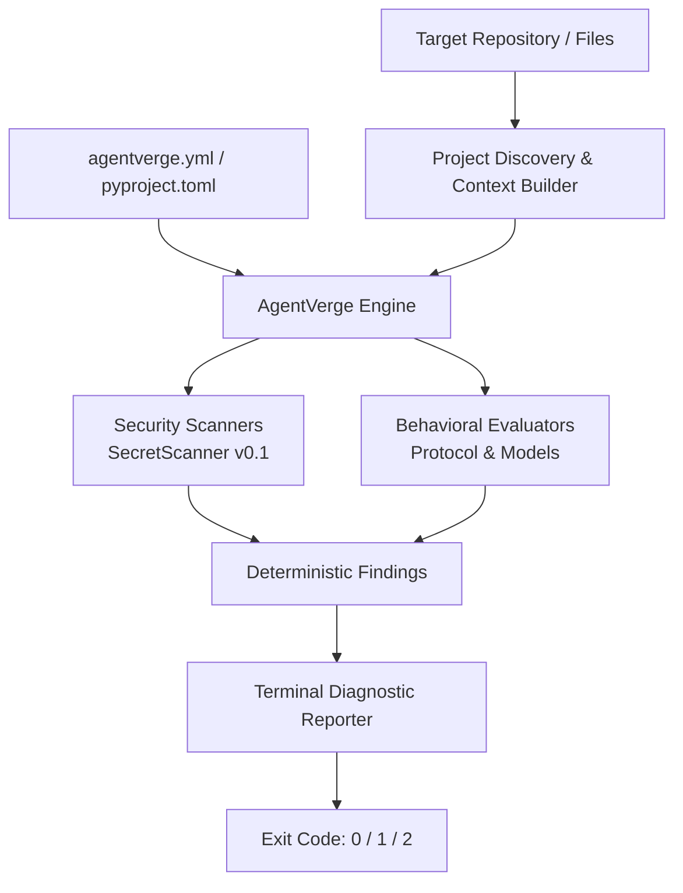

# AgentVerge

**The verification layer for AI agents.**

[](https://www.python.org/downloads/)
[](LICENSE)

AgentVerge is an open-source, local-first verification and safety tool designed to audit, validate, and constrain AI agent outputs and repositories with 100% deterministic checks.

---

## The Problem & Vision

As software engineering shifts toward autonomous coding agents, multi-agent frameworks, and AI-assisted pair programmers, developers face a critical verification gap:

- **Accidental credential exposure**: Agents frequently generate example configuration files, test scripts, or environment variables containing real or unmasked secrets.
- **Hallucinated task completion**: Agents often declare tasks resolved without verifying that output constraints or security requirements were met.
- **Opacity and non-determinism**: Relying on external LLM-as-a-judge evaluators introduces latency, non-reproducible checks, network dependencies, and recurring API costs.

**AgentVerge provides a deterministic verification gate** that runs directly on your local workstation or in CI/CD pipelines. It validates agent outputs before code is committed or deployed—with zero mandatory external network calls and zero paid API dependencies.

---

## Current Status & Capabilities (`v0.1.0`)

AgentVerge `v0.1.0` establishes the foundational scanning and project discovery engine:

- **Deterministic Secret & Credential Scanner**:
  - High-confidence regex and pattern-matching rules for exposed credentials.
  - Active detection rules:
    - **AWS Access Key IDs**: `AKIA...` and `ASIA...` patterns (`AGENTVERGE-SECRET-AWS-001`)
    - **GitHub Personal Access Tokens**: `ghp_...`, `github_pat_...` prefixes (`AGENTVERGE-SECRET-GITHUB-001`)
    - **Private Cryptographic Keys**: PEM-formatted private key blocks (`AGENTVERGE-SECRET-PRIVATE-KEY-001`)
    - **Hardcoded Secret Assignments**: Generic high-entropy credential assignments in code (`AGENTVERGE-SECRET-GENERIC-API-KEY-001`)
    - **Environment File Credentials**: Plaintext keys and secrets declared in `.env` files (`AGENTVERGE-SECRET-ENV-CRED-001`)
  - **Safe Redaction**: Masks sensitive token content in CLI tables and evidence snippets so secrets are never echoed to terminal logs.
  - **False-Positive Heuristics**: Automatically filters common placeholder tokens (`YOUR_API_KEY`, `EXAMPLE`, `DUMMY`, template interpolations `${...}`, etc.).

- **Project Discovery & Context Extraction**:
  - Automatically identifies repository markers (`.git`), package managers (`hatch`, `poetry`, `pip`, etc.), and candidate files.
  - Discovers AI instruction files (`AGENTS.md`, `CLAUDE.md`, `.cursorrules`) and Model Context Protocol (`mcp.json`) configurations.
  - Strictly respects `.gitignore` rules, custom exclude patterns, file count limits, and file size thresholds.

- **Hierarchical Configuration**:
  - Zero-config by default for immediate out-of-the-box scanning.
  - Supports configuration via `.agentverge.yml`, `.agentverge.yaml`, or `[tool.agentverge]` in `pyproject.toml`.
  - Configurable policy thresholds (e.g. `fail_on = ["high", "critical"]`).

- **CLI & CI-Ready Exit Codes**:
  - Rich terminal diagnostic output with tabular findings and remediation advice.
  - Standardized process exit codes:
    - `0`: Verification passed (no findings exceeding threshold).
    - `1`: Verification failed (findings exceeded severity threshold).
    - `2`: Configuration error or invalid discovery path.

---

## Architecture

AgentVerge enforces a strict separation of concerns between discovery, configuration, core verification, and presentation:



### Core Tenets

1. **Decoupled CLI & Core**: The core library (`agentverge.core`, `agentverge.scanners`, `agentverge.discovery`, `agentverge.models`) contains pure Python logic with no dependency on CLI frameworks.
2. **Deterministic & Offline**: Verification must produce identical results on identical inputs without unseeded randomness or outbound network calls.
3. **Protocol-Based Extensibility**: Scanners and Evaluators implement standard Python `typing.Protocol` interfaces for modular expansion.

---

## Quick Start

### Prerequisites

- Python 3.12+

### Installation

Clone the repository and install dependencies in a virtual environment:

```bash
# Clone repository
git clone https://github.com/MBasaran4/agentverge.git
cd agentverge

# Create and activate virtual environment
python -m venv .venv

# Windows (PowerShell):
.venv\Scripts\Activate.ps1
# Linux / macOS:
source .venv/bin/activate

# Install in editable mode with development tools
pip install -e ".[dev]"
```

---

## Example CLI Usage

### 1. Inspect Project Discovery & AI Context

Use `agentverge check` to inspect the project layout, detected AI instructions, and active configuration:

```bash
agentverge check .
```

**Output:**

```text
+--------------------------- AgentVerge Discovery ----------------------------+
|             Project Discovery Summary                                       |
|  Project Root      /path/to/project                                         |
|  Git Repository    Yes (.git marker found)                                  |
|  Python Project    Yes (package managers: hatch)                            |
|  Project Files     pyproject.toml                                           |
|  GitHub Workflows  None                                                     |
|  AI Instructions   AGENTS.md                                                |
|  MCP Configs       None detected                                            |
|  Configuration     Default (zero-config)                                    |
|  Candidate Files   50                                                       |
+-----------------------------------------------------------------------------+
```

### 2. Scan for Exposed Secrets and Credentials

Run `agentverge scan` to scan candidate files for hardcoded tokens, private keys, or credentials:

```bash
agentverge scan .
```

**When no secrets are detected:**

```text
No exposed secrets detected. (20 files scanned in 12.3ms)
```

**When exposed secrets are detected:**

```text
                    Security Findings: Exposed Credentials                     
+-----------------------------------------------------------------------------+
| Severity | Rule ID                   | Location         | Description       |
|----------+---------------------------+------------------+-------------------|
| CRITICAL | AGENTVERGE-SECRET-AWS-001 | src/config.py:14 | Exposed AWS Key   |
+-----------------------------------------------------------------------------+
Scan failed: 1 finding(s) detected across 20 files (14.2ms).
```

*(Raw credentials are automatically masked in evidence output to prevent accidental exposure in terminal logs.)*

### 3. Specify Custom Configuration

```bash
# Scan using an explicit configuration file
agentverge scan src/ --config .agentverge.yml
```

---

## Configuration

AgentVerge runs out of the box with zero configuration, but can be customized via `.agentverge.yml`, `.agentverge.yaml`, or `pyproject.toml`.

### Example `.agentverge.yml`

```yaml
# Severity levels that cause the scan to exit with code 1
thresholds:
  fail_on:
    - high
    - critical

# Additional path exclusions
exclude_patterns:
  - ".venv"
  - "dist"
  - "build"
  - "fixtures/mock_secrets"
```

### Example `pyproject.toml`

```toml
[tool.agentverge.thresholds]
fail_on = ["high", "critical"]

[tool.agentverge]
exclude_patterns = [".venv", "dist", "build"]
```

---

## Development & Testing

AgentVerge maintains strict typing and 100% deterministic test coverage:

```bash
# Run unit and integration tests
pytest

# Static type checking
mypy src tests

# Code linting
ruff check .

# Code format checking
ruff format --check .
```

---

## Roadmap

AgentVerge is developed around four foundational verification pillars. See [docs/ROADMAP.md](docs/ROADMAP.md) for complete milestone planning:

| Pillar | Focus Area | Status |
| :--- | :--- | :--- |
| **Pillar 1: Security Scanning** | Credential detection, AST dangerous execution (`eval`/`exec`), shell injection, path traversal | **In Progress** (Secrets live in v0.1.0) |
| **Pillar 2: Behavior Evaluation** | Output assertions, file diff boundaries, schema verification | Planned (v0.2.0) |
| **Pillar 3: Tool-Use Safety** | MCP tool schema validation, pre-execution command checking | Planned (v0.3.0) |
| **Pillar 4: CI & Ecosystem** | SARIF 2.1.0 output, GitHub Action integration, PR annotations | Planned (v0.4.0) |

---

## License

This project is licensed under the [MIT License](LICENSE).
