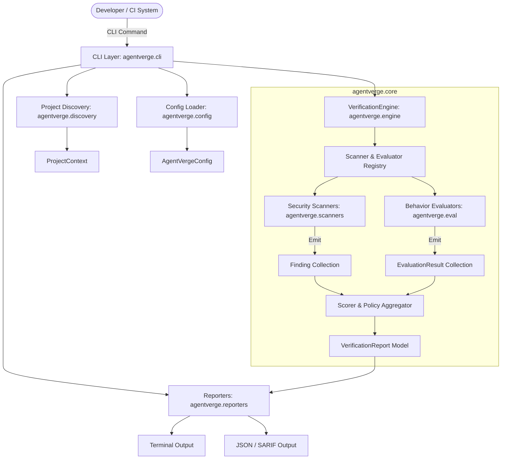

# AgentVerge Architectural Design

## 1. Architectural Overview & Design Philosophy

AgentVerge is designed around three architectural tenets:
1. **Core-CLI Decoupling**: The core engine is a pure Python library (`agentverge.core`) with zero dependency on CLI parsing frameworks, terminal formatting libraries, or environment I/O assumptions. The CLI is merely a consumer of the core library.
2. **Deterministic Core**: Verification results for identical inputs must be 100% reproducible. No random sampling, non-deterministic heuristics, or unseeded algorithms in the core pipeline.
3. **Pluggable & Protocol-Based**: Extensibility is achieved using lightweight Python `typing.Protocol` interfaces and standard entry points, avoiding heavyweight class hierarchies or framework lock-in.



---

## 2. Core Domain Separation

To avoid architectural muddiness, AgentVerge strictly partitions verification concerns into four isolated domains:

| Domain | Input Analyzed | Execution Nature | Primary Output |
| :--- | :--- | :--- | :--- |
| **Source-Code Security Scan** | Source files, git diffs, patches | Static (AST, regex, patterns) | `Finding` (vulnerabilities, secrets) |
| **Agent Behavior Evaluation** | Task specs, expected outputs, traces | Deterministic assertion logic | `EvaluationResult` (pass/fail, score) |
| **Tool-Use Safety** | Tool call descriptors, payloads, MCP schemas | Pre-execution boundary validation | `ToolSafetyFinding` (policy breaches) |
| **Runtime Monitoring** *(Future)* | OpenTelemetry spans, step streams | Telemetry listener / supervisor | `TraceMetrics` (loops, latency, cost) |

In the MVP, our focus is strictly on **Source-Code Security Scanning** and the foundational **Deterministic Behavior Evaluation**.

---

## 3. Core Domain Models (`agentverge.models`)

All domain entities are strictly validated via Pydantic (`pydantic>=2.0`) and are fully immutable (frozen models).

### 3.1 Severity Model
```python
from enum import Enum

class Severity(str, Enum):
    CRITICAL = "critical"
    HIGH = "high"
    MEDIUM = "medium"
    LOW = "low"
    INFO = "info"
```

### 3.2 Finding Model (Security & Static Checks)
```python
from pydantic import BaseModel, Field
from typing import Optional

class SourceLocation(BaseModel):
    file_path: str
    line_start: int
    line_end: Optional[int] = None
    column_start: Optional[int] = None
    column_end: Optional[int] = None
    snippet: Optional[str] = None

class Finding(BaseModel):
    rule_id: str
    title: str
    description: str
    severity: Severity
    location: SourceLocation
    remediation: Optional[str] = None
    scanner_id: str
    metadata: dict[str, str] = Field(default_factory=dict)
```

### 3.3 Evaluation Model (Behavioral & Assertion Checks)
```python
class EvaluationStatus(str, Enum):
    PASSED = "passed"
    FAILED = "failed"
    SKIPPED = "skipped"

class EvaluationResult(BaseModel):
    check_id: str
    name: str
    status: EvaluationStatus
    message: str
    expected: Optional[str] = None
    actual: Optional[str] = None
    duration_ms: float = 0.0
```

### 3.4 Top-Level Verification Report
```python
class VerificationSummary(BaseModel):
    total_findings: int
    critical_count: int
    high_count: int
    medium_count: int
    low_count: int
    eval_checks_passed: int
    eval_checks_failed: int
    overall_score: float  # 0.0 to 100.0
    passed: bool

class VerificationReport(BaseModel):
    version: str
    timestamp: str
    project_root: str
    findings: list[Finding] = Field(default_factory=list)
    evaluations: list[EvaluationResult] = Field(default_factory=list)
    summary: VerificationSummary
```

---

## 4. Subsystem Breakdown

### 4.1 Project Discovery (`agentverge.discovery`)
Responsible for locating candidate files and agent contexts:
* Discovers target files adhering to include/exclude patterns and `.gitignore`.
* Discovers agent specification files (e.g., `agent.yaml`, `.cursorrules`, `prompts/`, tool definitions).
* Produces an immutable `ProjectContext` container injected into the engine.

### 4.2 Configuration Loading (`agentverge.config`)
* Standardized configuration schema via `AgentVergeConfig`.
* Sources configuration from `agentverge.toml` or `pyproject.toml` (`[tool.agentverge]`).
* Provides zero-configuration defaults so running `agentverge scan` works out of the box.

### 4.3 Scanner Subsystem (`agentverge.scanners`)
* Scanners implement the `Scanner` protocol.
* Built-in MVP scanners:
  * `SecretScanner`: High-entropy string and known token format detection (API keys, private keys).
  * `DangerousExecutionScanner`: AST-based detection of dangerous Python invocations (`eval`, `exec`, `subprocess.run(..., shell=True)`).
  * `PathTraversalScanner`: Insecure file operations accepting unvalidated dynamic paths.

### 4.4 Evaluation Engine (`agentverge.eval`)
* Evaluators implement the `Evaluator` protocol.
* Built-in MVP evaluators:
  * `FileExistenceEvaluator`: Verifies required artifacts exist.
  * `ContentAssertionEvaluator`: Deterministic assertions on generated outputs (regex match, JSON schema validity).
  * `DiffBoundaryEvaluator`: Ensures the agent did not touch files outside its declared permission boundary.

### 4.5 Scoring & Quality Gate Engine (`agentverge.engine`)
* Aggregates findings and evaluation results.
* Calculates a normalized 0–100 security/quality score using weighted severity deduction.
* Applies policy gates (e.g., `fail_on: ["high", "critical"]`).

### 4.6 Reporting Subsystem (`agentverge.reporters`)
* Decoupled report formatters receiving `VerificationReport`:
  * `TerminalReporter`: Clean CLI formatting with color coding and actionable remediation steps.
  * `JsonReporter`: Deterministic JSON serialization for CI/CD pipelines.

---

## 5. Plugin Architecture & Extensibility

AgentVerge uses standard Python `typing.Protocol` to define plugin contracts. No subclassing of base framework classes is strictly required; structural subtyping is supported.

```python
from typing import Protocol, runtime_checkable

@runtime_checkable
class Scanner(Protocol):
    scanner_id: str
    name: str
    description: str

    def scan(self, context: ProjectContext) -> list[Finding]:
        """Execute static security checks on discovered files."""
        ...

@runtime_checkable
class Evaluator(Protocol):
    evaluator_id: str
    name: str

    def evaluate(self, context: ProjectContext) -> list[EvaluationResult]:
        """Execute deterministic behavioral assertions."""
        ...
```

Third-party scanners and evaluators can be registered via `agentverge.plugins` using `importlib.metadata` entry points (`agentverge.scanners` and `agentverge.evaluators`).

---

## 6. Dependency Injection & Testability

* **No Global State**: The `VerificationEngine` receives scanners, evaluators, and configuration via its constructor (`__init__`).
* **Test Isolation**: In unit tests, mock or in-memory scanners and evaluators can be injected without filesystem touching or monkeypatching.
* **Deterministic I/O**: File reading and directory walking are abstracted behind a `FileSystem` interface or parameterized through `ProjectContext`.
