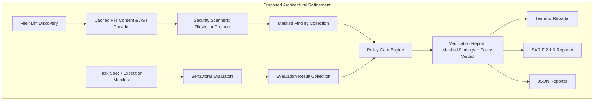

# AgentVerge Architectural Review & Critique

**Reviewer**: Senior Open-Source Software Architect  
**Target Repository**: AgentVerge (`MBasaran4/agentverge`)  
**Documents Reviewed**:
* `AGENTS.md`
* `docs/PRODUCT.md`
* `docs/ARCHITECTURE.md`
* `docs/ROADMAP.md`
* `docs/THREAT_MODEL.md`
* `docs/DECISIONS.md`

---

## 1. Executive Summary

AgentVerge proposes an open-source, local-first verification engine to secure and validate autonomous AI agents and AI-generated code. Its foundational tenets—deterministic verification, zero mandatory cloud/LLM-as-a-judge API dependencies, local-first execution, and strong typing via Pydantic v2—are commendable and address a genuine pain point in modern software engineering.

However, a rigorous architectural critique reveals that the project currently suffers from an identity split: it attempts to bridge **static application security testing (SAST)** and **agent behavioral evaluation** without a coherent unifying intermediate representation (IR). Several critical subsystems suffer from premature abstractions, coarse protocol designs, security vulnerabilities in the verifier itself, and documentation contradictions between the MVP roadmap and architectural specifications.

Before code implementation begins, the architecture requires surgical refinement to ensure performance, security, maintainability, and contributor ergonomics.

---

## 2. Conceptual Comparison with State-of-the-Art Tooling

| Capability / Domain | Modern Ecosystem Leaders | Proposed AgentVerge Architecture | Architectural Gap / Risk |
| :--- | :--- | :--- | :--- |
| **Static Code Security** | **Semgrep, Bandit, Ruff** | Custom AST visitor (`ast`) & Regex scanner in Python | **Language Lock-in**: Standard `ast` limits static scanning to Python. Polyglot agent output (TypeScript, Bash, SQL, Go) is completely invisible to AST scanners. Homegrown AST visitors risk high maintenance and incomplete vulnerability coverage. |
| **Secret Detection** | **Gitleaks, TruffleHog** | Custom `SecretScanner` using regex and Shannon entropy | **False-Positive Avalanche**: Plain entropy + generic regex yields massive false-positive rates on base64 assets, hashes, and lockfiles, or misses real tokens without verified vendor signatures. |
| **Agent Behavior Evaluation** | **Inspect AI (UK AISI), DeepEval, promptfoo, Ragas** | `FileExistenceEvaluator`, `ContentAssertionEvaluator`, `DiffBoundaryEvaluator` | **Missing Task/Trajectory Abstraction**: State-of-the-art eval tools evaluate structured agent trajectories (prompts, step transitions, tool invocations, task specs). AgentVerge’s MVP evaluates raw directory files without a formal task manifest or trace ingestion schema. |
| **Tool-Use Safety** | **Aider sandbox, E2B, MCP Inspector** | Static schema checking (deferred to Phase 3) | **Late Gate vs. Pre-Execution**: Tool-use safety is inherently runtime/pre-execution. Evaluating tool safety statically in a post-execution CLI cannot prevent destructive actions that already executed. |
| **CI/CD & Reporting** | **SARIF v2.1.0, GitHub Code Scanning** | Custom JSON & Terminal reporting (SARIF deferred in Roadmap) | **Adoption Barrier**: Without SARIF v2.1.0 in Phase 1, automated integration into GitHub Code Scanning and PR annotations is compromised. |

---

## 3. Critical Review Across the 12 Architectural Dimensions

### 3.1 Unnecessary Complexity

1. **Premature Four-Pillar Segregation**:
   The architecture heavily emphasizes the "Four Pillars" (Source-Code Scanning, Behavior Evaluation, Tool-Use Safety, Runtime Monitoring). However, in Phase 1 (MVP), attempting to build both a SAST scanner and a behavioral evaluator creates split focus. The two engines have completely different lifecycle inputs: SAST requires code/diffs, while behavioral evaluation requires task specifications and agent execution traces.
2. **Arbitrary Unified Scoring Metric (`overall_score: 0.0 - 100.0`)**:
   In `VerificationSummary`, the architecture combines SAST security vulnerabilities with functional evaluation test results into a single composite score (`0.0 to 100.0`). This is a dangerous antipattern:
   * A repository that introduces a `CRITICAL` shell injection (`subprocess.run(..., shell=True)`) but passes 9 file-existence assertions might receive an overall score of `85.0%`.
   * Security gates must be absolute threshold gates (fail-on-critical), whereas behavioral evaluations are functional pass/fail assertions. Conflating them into an arbitrary composite float obscures critical security risks.

### 3.2 Premature Abstractions

1. **The `ProjectContext` Monolith**:
   The `ProjectContext` container is passed indiscriminately to both `Scanner.scan(context)` and `Evaluator.evaluate(context)`.
   * `ProjectContext` is designed around directory walking and file lists (`context.target_files`).
   * For an evaluator (e.g. `DiffBoundaryEvaluator`), what it actually needs is a **Git diff summary** or a **Task execution manifest**.
   * By forcing both subsystems to consume `ProjectContext`, scanners are forced to re-filter files, and evaluators are starved of behavioral execution context.
2. **Coarse-Grained Protocol Contracts**:
   `Scanner.scan(context: ProjectContext) -> list[Finding]` gives every scanner the entire project at once.
   * If there are 10 static scanners, each scanner must independently loop over `context.target_files`, read disk contents, and parse the AST.
   * There is no file-level visitor abstraction, no parsed AST cache, and no single-pass file abstraction.

### 3.3 Security Flaws in the Verifier Itself

1. **ReDoS Vulnerability in Secret Scanning**:
   `THREAT_MODEL.md` (T6) acknowledges ReDoS risks, but proposes using Python's standard `re` module. Python's built-in `re` is an NFA engine subject to catastrophic backtracking $O(2^n)$ on untrusted, agent-generated long strings or minified code. A malicious prompt injection could force the agent to generate an adversarial string that hangs AgentVerge in CI indefinitely.
2. **AST Parsing Denial of Service (AST Bombs)**:
   Python's built-in `ast.parse` is executed synchronously in CPython. Deeply nested parenthesized expressions (`((((...))))`) or deeply nested binary operators can cause C-level stack overflow or `RecursionError`. Standard Python does not support cross-platform thread timeouts on synchronous C extensions without process isolation (`multiprocessing`).
3. **Plaintext Secret Leakage in Findings**:
   `Finding.location.snippet` stores the code snippet matching the rule. When `SecretScanner` flags an AWS Secret Key or GitHub token, storing the raw secret in the snippet causes the verifier to leak sensitive credentials into:
   * Plaintext CI job logs
   * Terminal stdout
   * Machine-readable JSON reports stored as build artifacts
   The domain model lacks a mandatory token masking/redaction mechanism at the data-model level.
4. **Symlink Traversal and Out-of-Bounds Escapes**:
   `ProjectContext` discovers files matching patterns. If an untrusted agent creates a symlink pointing to `/etc/passwd` or `~/.ssh/id_rsa`, the scanner will resolve and inspect files outside the repository root, potentially dumping confidential host data into the scan report.

### 3.4 Unclear Module Boundaries & Structural Discrepancies

1. **Engine vs. Core Package Ambiguity**:
   * In `ARCHITECTURE.md` (line 19): `CLI --> Engine [VerificationEngine: agentverge.engine]`.
   * In `ARCHITECTURE.md` (Section 4.5): "Scoring & Quality Gate Engine (`agentverge.engine`)".
   * In `AGENTS.md` (Directory Layout, line 49): `src/agentverge/core/ # Engine orchestration, registry, scoring`.
   * There is an unresolved naming and location clash: is it `agentverge.core` or `agentverge.engine`?
2. **Reporters Layer Placement**:
   * `AGENTS.md` Rule 1 mandates: *"NEVER import CLI modules, terminal formatters, or CLI argument parsers into agentverge.core, scanners, eval, or models."*
   * But `reporters` resides in `src/agentverge/reporters/`. Does `TerminalReporter` use Rich/colorama? If so, `reporters` contains terminal formatting dependencies. Who calls `reporters`?
   * If the CLI calls `reporters`, then `TerminalReporter` is effectively a CLI presentation adapter. If `VerificationEngine` calls `reporters`, then `reporters` leaks terminal output dependencies into the core engine pipeline.

### 3.5 Poor Extensibility

1. **Missing Scanner Configuration Contract**:
   `Scanner.scan(context: ProjectContext)` passes no rule-specific configuration.
   * If a user configures `agentverge.toml` with:
     ```toml
     [scanners.dangerous_execution]
     allowed_calls = ["subprocess.run"]
     ```
     The `Scanner` protocol provides no mechanism for the engine to pass this configuration to the scanner instance.
   * Either every scanner must reach into a monolithic global configuration object, or third-party scanners cannot be customized.
2. **All-or-Nothing Batch Returns (No Streaming)**:
   Scanners return `list[Finding]`. For massive codebases or long monorepo diffs, the engine cannot stream findings progressively to the CLI or CI output. A generator interface (`Iterator[Finding]`) would provide responsive streaming and early termination.

### 3.6 Testing Problems

1. **Tight Coupling to Disk I/O**:
   Although `ARCHITECTURE.md` Section 6 claims: *"File reading and directory walking are abstracted behind a FileSystem interface or parameterized through ProjectContext"*, the actual protocol examples in `AGENTS.md` show:
   ```python
   for file_path in context.target_files:
       # Scanners directly read file_path from the host filesystem
   ```
   There is no virtual `FileSystem` protocol or in-memory file provider defined in `models` or `discovery`. Unit tests for custom scanners will be forced to write temporary files to disk using `tmp_path`, slowing down test execution and increasing disk thrashing.
2. **Missing Input Artifacts for Behavioral Evaluators**:
   `FileExistenceEvaluator` and `DiffBoundaryEvaluator` require assertions against what the agent *intended* to do. In tests, asserting `DiffBoundaryEvaluator` without a standardized Git diff fixture or task spec makes unit testing brittle and dependent on live Git repositories.

### 3.7 CLI / Core Coupling & Side-Effect Leakage

1. **Diagnostic Logging vs. Machine-Readable Stdout**:
   If a scanner encounters an unparseable file (`SyntaxError`), it must record a diagnostic. If it prints to `stdout` or logs via standard `logging.StreamHandler`, it will corrupt JSON output piped to `jq` or CI steps (`agentverge scan --format json > report.json`).
   * Diagnostic errors must be first-class domain models (e.g. `VerificationError` or `Diagnostic` collection inside `VerificationReport`), not raw logging side effects.
2. **Exit Code Policy Responsibility**:
   Exit code logic (`0`, `1`, `2`) is described in `AGENTS.md`. The policy evaluation (whether findings exceed the threshold) must be encapsulated purely in `agentverge.core.policy`, returning a deterministic enum (`PolicyVerdict.PASSED | FAILED`), leaving only the integer conversion (`sys.exit(verdict.exit_code)`) to the CLI.

### 3.8 Plugin Architecture Problems

1. **Over-reliance on `importlib.metadata.entry_points`**:
   `ADR-006` mandates plugin registration via Python entry points.
   * Entry point resolution incurs measurable import overhead (50–150ms on cold start), conflicting directly with the sub-200ms startup goal.
   * **No Support for Local Rules**: An enterprise or developer writing a custom rule for their internal repo should not be forced to package and install an entire Python wheel via `pip install`. They should be able to drop a `.py` rule or declarative rule into `.agentverge/rules/` and have it automatically discovered.
2. **Fragility of `@runtime_checkable` Protocols**:
   `@runtime_checkable` in Python only verifies attribute presence, not method signatures, return types, or argument counts. An invalid third-party scanner will pass `isinstance(p, Scanner)` and crash deep inside the engine runloop.

### 3.9 Dependency Risks & Technical Debt

1. **The Python-Only AST Trap**:
   `PRODUCT.md` states: *"Framework-Agnostic: Operates independently of underlying agent frameworks"*. But agents generate code in dozens of languages.
   * `ast.parse` only supports Python syntax.
   * If an agent writes JavaScript, TypeScript, Go, Rust, or Shell scripts, AgentVerge cannot parse or secure it with AST scanners.
   * The architecture does not specify how polyglot static analysis will ever be supported without abandoning standard `ast` in favor of Tree-sitter or external engines.
2. **Dependency Omissions**:
   `ADR-007` lists minimal dependencies (`pydantic`, `tomli`, `click/typer`, `pytest`). Yet:
   * `ContentAssertionEvaluator` requires JSON Schema validation (requires `jsonschema`).
   * `SecretScanner` requires entropy computation and high-speed regex.
   * `TerminalReporter` requires rich table rendering (requires `rich`).
   These dependencies are omitted from the ADR, creating a false impression of a zero-dependency footprint.

### 3.10 Friction for Open-Source GitHub Contributors

1. **Centralized Manual Registration Merge Conflicts**:
   `AGENTS.md` instructions 3 & 4 state:
   * *"Place the scanner in src/agentverge/scanners/."*
   * *"Register it in src/agentverge/scanners/__init__.py."*
   When multiple open-source contributors submit PRs adding new security rules simultaneously, `__init__.py` will suffer constant merge conflicts. A decentralized registration decorator (e.g. `@register_scanner`) or auto-discovery registry is essential for smooth community collaboration.
2. **Lack of a Declarative Rule Specification**:
   Writing an imperative Python AST visitor for every single pattern check raises the contribution bar too high. Contributors should be able to contribute simple regex, AST-grep, or YAML-based lint rules without writing boilerplate Python classes.

### 3.11 Architectural Conflicts with MVP Scope

1. **The Ingestion Gap for Evaluators**:
   `ROADMAP.md` Phase 1 includes `FileExistenceEvaluator`, `ContentAssertionEvaluator`, and `DiffBoundaryEvaluator`.
   * However, there is no specification file format defined for users to state what files are expected!
   * Without a defined schema (e.g. `agentverge.eval.toml` or `task_spec.json`), how does `FileExistenceEvaluator` know what files to check? It cannot be implemented generically without a task specification contract.
2. **`scan` vs. `check` Conceptual Muddle**:
   * `agentverge scan` runs scanners.
   * `agentverge check` runs scanners + evaluations.
   If evaluations lack an input task spec, `agentverge check` is effectively unusable in general repositories.

### 3.12 Features that Must Be Postponed or Redesigned

1. **Postpone Generic Behavioral Evaluation until Phase 2**:
   Behavioral evaluation without agent trace/trajectory ingestion is incomplete. For Phase 1, AgentVerge should focus on being the best **Local-First Security & Boundary Gate for Agent Diffs**.
2. **Redesign the Composite Scoring Engine**:
   Replace the `0.0 - 100.0` aggregate float score with an explicit **Security Status Gate** (`PASS | FAIL` based on severity threshold) and an independent **Evaluation Summary** (`Passed: X, Failed: Y`).
3. **Drop Custom Shannon Entropy for MVP Secret Scanning**:
   Building a custom high-entropy secret scanner in Python from scratch is notoriously error-prone. In MVP, restrict secret scanning to high-confidence, well-known token prefix formats (e.g. `sk-proj-*`, `ghp_*`, `AKIA*`, `Bearer *`), avoiding noisy raw entropy calculations until verification and allowlisting mechanisms are mature.

---

## 4. Documentation Inconsistency Matrix

| Document A | Document B | Inconsistency Detected | Resolution Required |
| :--- | :--- | :--- | :--- |
| **`ARCHITECTURE.md`** (Lines 37, 174) | **`ROADMAP.md`** (Phase 2, Line 48) | `ARCHITECTURE.md` shows SARIF output in the Core Architecture diagram for MVP, while `ROADMAP.md` defers SARIF export to Phase 2. | Promote SARIF v2.1.0 to MVP. CI/CD adoption depends heavily on SARIF. |
| **`ARCHITECTURE.md`** (Lines 19, 165) | **`AGENTS.md`** (Directory Layout, Line 49) | `ARCHITECTURE.md` references `agentverge.engine`, whereas `AGENTS.md` places the engine in `agentverge.core`. | Unify strictly on `agentverge.core.engine`. Delete all references to `agentverge.engine`. |
| **`PRODUCT.md`** (Section 2, Line 22) | **`PRODUCT.md`** (Section 3, Pillar 2) | Declares "Zero Mandatory Paid APIs", but Pillar 2 lists "Jailbreak/prompt injection robustness checks", which practically require an LLM evaluator or adversarial oracle. | Clarify that jailbreak/injection checks in core are strictly deterministic static pattern matching, not dynamic model red-teaming. |
| **`DECISIONS.md`** (ADR-007) | **`ARCHITECTURE.md`** (Section 4.4, 4.6) | ADR-007 excludes `rich` and `jsonschema` from dependencies, yet Architecture requires JSON schema validation and rich terminal reporting. | Update ADR-007 to explicitly include `rich` and `jsonschema` (or state how they are implemented without dependencies). |
| **`ARCHITECTURE.md`** (Line 212) | **`AGENTS.md`** (Line 77) | `ARCHITECTURE.md` claims file I/O is abstracted behind a `FileSystem` interface; `AGENTS.md` code sample shows direct path iteration without a filesystem abstraction. | Specify the `FileSystem` abstraction formally in `agentverge.discovery` or `agentverge.models`. |

---

## 5. Architectural Score: 74 / 100

### Score Breakdown
* **Architectural Vision & Tenets (9/10)**: Strong principles, excellent local-first and zero-cloud commitment.
* **Core-CLI Decoupling (9/10)**: Clean conceptual separation between library and CLI execution.
* **Security & Safety of the Verifier (5/10)**: Severe risks of ReDoS, AST parsing hangs, and credential leakage in reports.
* **Extensibility & Contributor Ergonomics (6/10)**: Coarse protocol abstractions, manual registration merge conflicts, missing local file rule support.
* **Scope Feasibility & MVP Alignment (7/10)**: Conflation of behavioral evaluation and security scanning; missing task specification contract.
* **Specification Consistency (7/10)**: Minor package naming conflicts and SARIF roadmap discrepancies across docs.

---

## 6. The Five Mandatory Architectural Changes Before Implementation



### 1. Introduce a Single-Pass `FileContentProvider` and `FileVisitor` Scanner Protocol
Replace the coarse `Scanner.scan(context: ProjectContext)` protocol with a file-centric visitor protocol backed by an in-memory caching content provider.
* **Why**: Prevents multiple scanners from re-reading and re-parsing ASTs on the same file, accelerates execution by 5–10x, and enables 100% in-memory testing without touching disk.
* **Proposed Design**:
  ```python
  class FileContentProvider(Protocol):
      def read_text(self, path: str) -> str: ...
      def get_ast(self, path: str) -> ast.AST | None: ...

  class FileScanner(Protocol):
      scanner_id: str
      file_patterns: list[str]  # e.g. ["*.py"]
      def scan_file(self, path: str, content: str, tree: ast.AST | None) -> list[Finding]: ...
  ```

### 2. Implement Mandatory Token Redaction in `Finding` and Secure Parsing Defenses
Ensure the verifier cannot be exploited or leak credentials.
* **Redaction**: Add a `redacted_snippet` property or validator to `Finding.location` so secrets are never saved in cleartext.
* **Safe Regex**: Use precompiled, non-backtracking regular expressions, and enforce strict length bounds ($< 10\text{ KB}$) on lines passed to secret regex matchers to eliminate ReDoS.
* **AST Protection**: Wrap `ast.parse` with explicit file-size guards (e.g. skip AST on minified single-line files $> 500\text{ KB}$) and catch `RecursionError` cleanly as a diagnostic warning.

### 3. Decouple Functional Score from Security Gate
Abolish the unified 0–100 `overall_score`.
* **Security Gate**: Binary pass/fail verdict driven strictly by configured policy (`fail_on = ["high", "critical"]`). Any critical finding triggers `verdict = FAILED`.
* **Quality / Assertion Gate**: Metrics-based summary (`passed_count`, `failed_count`, `skipped_count`).
* Keep their reporting visually distinct in CLI and JSON summaries so a repository cannot "average out" a critical vulnerability.

### 4. Separate Behavioral Evaluation into a Formal Task Manifest Subsystem
Do not run behavioral evaluators on naked repository folders without context.
* Formalize `TaskSpec` or `AgentRunManifest` (specifying task prompt, permitted edit boundaries, expected output files, and assertion criteria).
* `agentverge scan`: Scans source files and Git diffs for security violations (zero configuration needed).
* `agentverge check --manifest run.json`: Evaluates task execution against the formal manifest.

### 5. Standardize on SARIF v2.1.0 in Phase 1 and Add a Local Rule Decorator
* **SARIF in MVP**: Promote SARIF export to Phase 1. GitHub Code Scanning and PR annotations are the primary reason developers adopt CI security tools.
* **Decentralized Registry**: Replace manual registration in `__init__.py` with a simple registry pattern:
  ```python
  @register_scanner("dangerous-execution")
  class DangerousExecutionScanner: ...
  ```
  This eliminates Git merge conflicts for open-source contributors and allows seamless loading of local workspace rules from `.agentverge/rules/*.py`.
